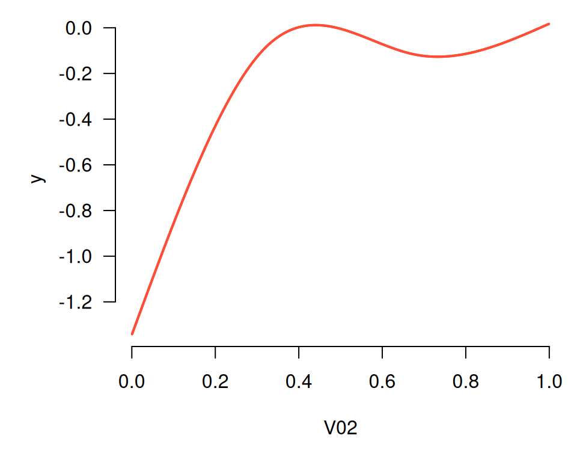
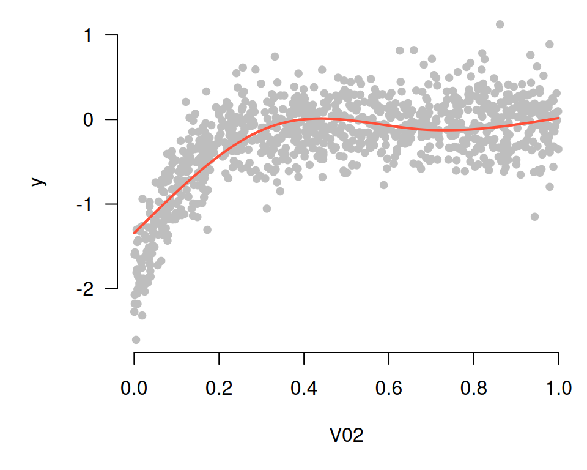
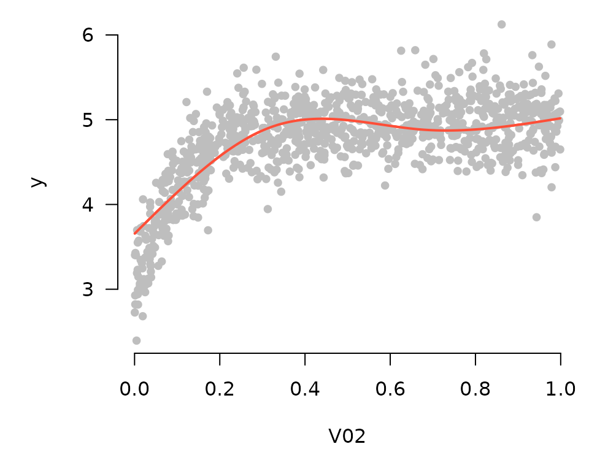
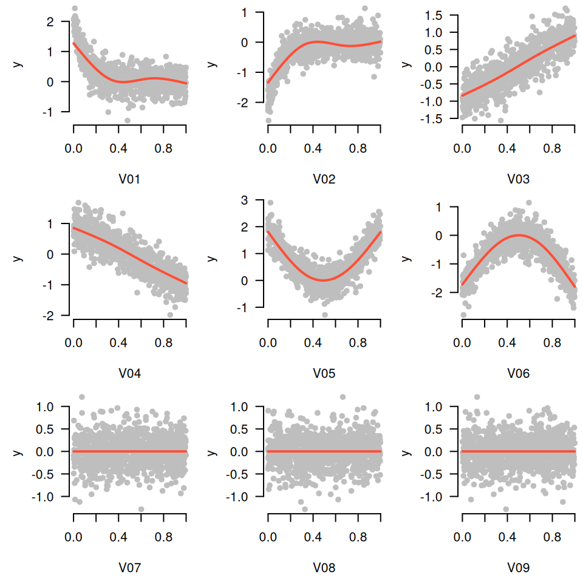
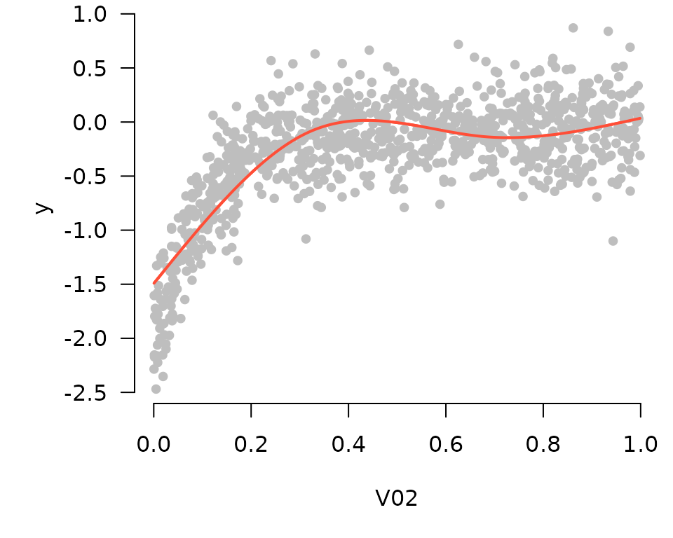

# Additive models

Starting in version 3.4, **grpreg** offers an interface for setting up,
fitting, and visualizing additive models. Numeric features are
automatically expanded using spline basis functions. The basic idea was
first proposed by [Ravikumar et
al. (2009)](https://doi.org/10.1111/j.1467-9868.2009.00718.x), who
called it SPAM, for sparse additive models. The original proposal
involved the group lasso penalty, but any of **grpreg**’s penalty
functions can be used instead. The basic usage is illustrated below.

Let’s start by generating some nonlinear data:

``` r
Data <- gen_nonlinear_data(n=1000)
Data$X[1:5, 1:5]
#            V01       V02       V03       V04        V05
# [1,] 0.2655087 0.5308088 0.8718050 0.8023495 0.18776846
# [2,] 0.3721239 0.6848609 0.9671970 0.4794952 0.50475902
# [3,] 0.5728534 0.3832834 0.8669163 0.1774016 0.02728685
# [4,] 0.9082078 0.9549880 0.4377153 0.3971333 0.49629785
# [5,] 0.2016819 0.1183566 0.1919378 0.8142270 0.94735171
dim(Data$X)
# [1] 1000   16
```

The matrix `Data$X` contains 16 numeric features, named `V01`, `V02`,
and so on. Each of those features can be expanded via the
[`expand_spline()`](https://pbreheny.github.io/grpreg/reference/expand_spline.md)
function:

``` r
X <- expand_spline(Data$X)
X$X[1:5, 1:5]
#            V01_1     V01_2      V01_3         V02_1     V02_2
# [1,] -0.08336582 0.4929033 -0.3278096  0.3891472555 0.4436426
# [2,]  0.04192555 0.5477306 -0.3641231  0.5513529028 0.3304199
# [3,]  0.45894631 0.4124200 -0.2155968  0.0820511444 0.5393188
# [4,]  0.14591619 0.3715847  0.4789722  0.0003839531 0.4039176
# [5,] -0.10101672 0.4080372 -0.2713687 -0.0764163587 0.2604782
dim(X$X)
# [1] 1000   48
head(X$group)
# [1] "V01" "V01" "V01" "V02" "V02" "V02"
```

The resulting object is a list that contains the expanded matrix `X$X`
and the group assignments `X$group`, along with some metadata needed by
internal functions. Note that `X$X` now contains 48 columns – each of
the 16 numeric features (`V01`) has been expanded into a 3-column matrix
(`V01_1`, `V01_2`, and `V01_3`). By default,
[`expand_spline()`](https://pbreheny.github.io/grpreg/reference/expand_spline.md)
uses natural cubic splines with three degrees of freedom, but consult
its documentation for additional options.

This expanded matrix can now be passed to
[`grpreg()`](https://pbreheny.github.io/grpreg/reference/grpreg.md):

``` r
fit <- grpreg(X, Data$y)
```

Note that it is not necessary to pass grouping information in this case,
as it is contained with the `X` object. At this point, all of the usual
tools [`coef()`](https://rdrr.io/r/stats/coef.html),
[`predict()`](https://rdrr.io/r/stats/predict.html), etc., can be used,
as well as
[`plot.grpreg()`](https://pbreheny.github.io/grpreg/reference/plot.grpreg.md).
However, **grpreg** also offers a function,
[`plot_spline()`](https://pbreheny.github.io/grpreg/reference/plot_spline.md),
specific to additive models:

``` r
plot_spline(fit, "V02", lambda = 0.03)
```



Partial residuals can be included in these plots as well:

``` r
plot_spline(fit, "V02", lambda = 0.03, partial=TRUE)
```



By default, these plots are centered such that at the mean of x (where x
denotes the feature being plotted), the y value is zero. Alternatively,
if `type="conditional"` is specified,
[`plot_spline()`](https://pbreheny.github.io/grpreg/reference/plot_spline.md)
will construct a plot in which the vertical axis represents model
predictions as x varies and all other features are fixed at their mean
value:

``` r
plot_spline(fit, "V02", lambda = 0.03, partial=TRUE, type='conditional')
```



In comparing these two plots, note that the general contours are the
same; the only difference is the value of the vertical axis. Here are
the plots for the first 9 coefficients:

``` r
for (i in 1:9) plot_spline(fit, sprintf("V%02d", i), lambda = 0.03, partial=TRUE, warn=FALSE)
```



In the generating model, variables 3 and 4 had a linear relationship
with the outcome, variables 1, 2, 5, and 6 had nonlinear relationships,
and all other variables were unrelated. The sparse additive model has
captured this nicely.

These tools work with cross-validation as one would expect (by default
plotting the fit that minimizes cross-validation error):

``` r
cvfit <- cv.grpreg(X, Data$y)
plot_spline(cvfit, "V02", partial=TRUE)
```



Finally, these tools work with survival and glm models as well. Here,
all plots are returned on the linear predictor scale, and the residuals
are deviance residuals.
