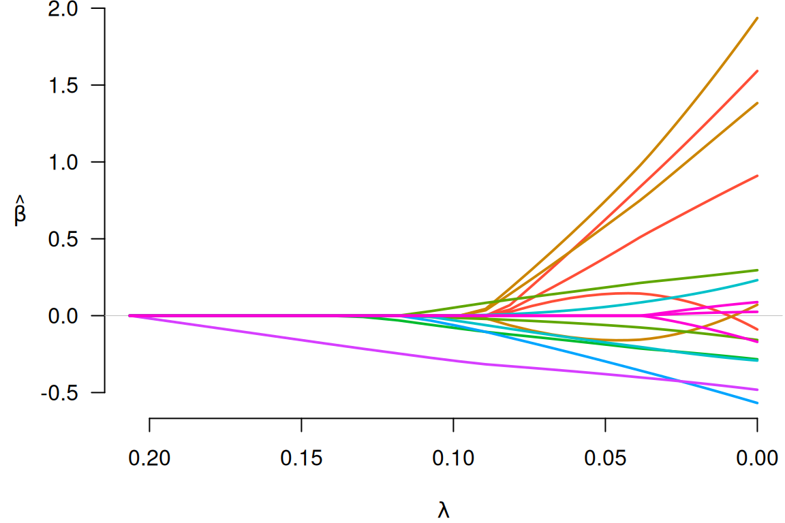
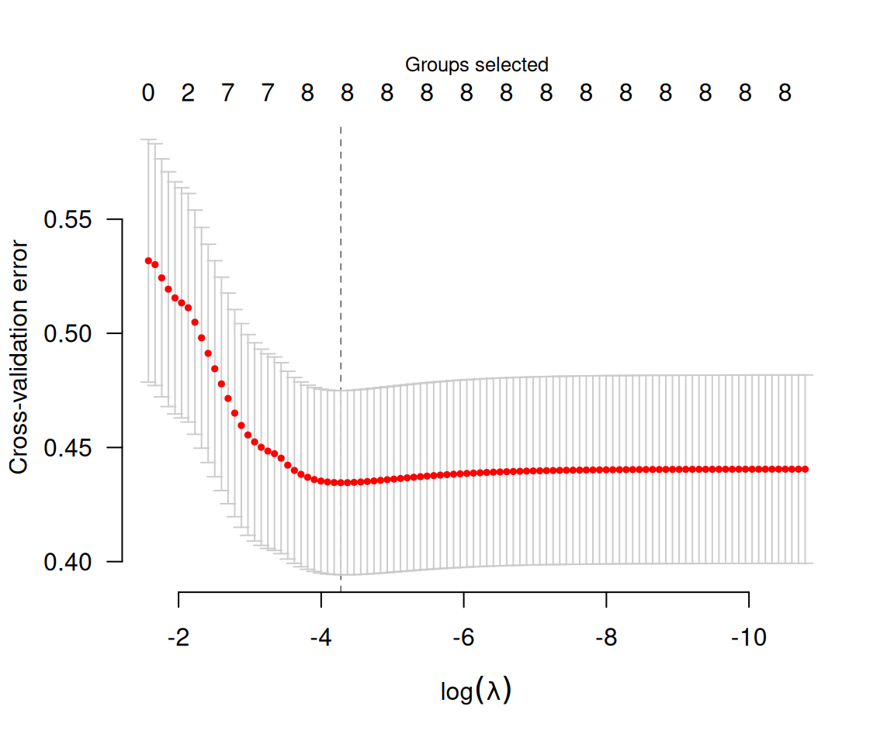

# Getting started with grpreg

**[grpreg](https://pbreheny.github.io/grpreg/)** is an R package for
fitting the regularization path of linear regression, GLM, and Cox
regression models with grouped penalties. This includes group selection
methods such as group lasso, group MCP, and group SCAD as well as
bi-level selection methods such as the group exponential lasso, the
composite MCP, and the group bridge. Utilities for carrying out
cross-validation as well as post-fitting visualization, summarization,
and prediction are also provided.

**grpreg** comes with a few example data sets; we’ll look at `Birthwt`,
which involves identifying risk factors associated with low birth
weight. The outcome can either be measured continuously (`bwt`, the
birth weight in kilograms) or dichotomized (`low`) with respect to the
newborn having a low birth weight (under 2.5 kg).

``` r
data(Birthwt)
X <- Birthwt$X
y <- Birthwt$bwt
head(X)
#             age1         age2         age3        lwt1        lwt2         lwt3
# [1,] -0.05833434  0.011046300  0.029561818  0.12446282 -0.02133871 -0.130731102
# [2,]  0.13436561  0.055245529 -0.096907046  0.06006722 -0.06922831 -0.033348413
# [3,] -0.04457006 -0.009415469  0.045088774 -0.05918388  0.03746349  0.004618178
# [4,] -0.03080577 -0.026243567  0.052489640 -0.05202881  0.02390664  0.019034579
# [5,] -0.07209862  0.035141739  0.004821882 -0.05441384  0.02832410  0.014571538
# [6,] -0.03080577 -0.026243567  0.052489640 -0.01386846 -0.03296942  0.049559472
#      white black smoke ptl1 ptl2m ht ui ftv1 ftv2 ftv3m
# [1,]     0     1     0    0     0  0  1    0    0     0
# [2,]     0     0     0    0     0  0  0    0    0     1
# [3,]     1     0     1    0     0  0  0    1    0     0
# [4,]     1     0     1    0     0  0  1    0    1     0
# [5,]     1     0     1    0     0  0  1    0    0     0
# [6,]     0     0     0    0     0  0  0    0    0     0
```

The original design matrix consisted of 8 variables, which have been
expanded here into 16 features. For example, there are multiple
indicator functions for race (“other” being the reference group) and
several continuous factors such as age have been expanded using
polynomial contrasts (splines would give a similar structure). Hence,
the columns of the design matrix are *grouped*; this is what grpreg is
designed for. The grouping information is encoded as follows:

``` r
group <- Birthwt$group
group
#  [1] age   age   age   lwt   lwt   lwt   race  race  smoke ptl   ptl   ht   
# [13] ui    ftv   ftv   ftv  
# Levels: age lwt race smoke ptl ht ui ftv
```

Here, groups are given as a factor; unique integer codes (which are
essentially unlabeled factors) and character vectors are also allowed
(character vectors do have some limitations, however, as the order of
the groups is left unspecified, which can lead to ambiguity if you also
try to set the `group.multiplier` option). To fit a group lasso model to
this data:

``` r
fit <- grpreg(X, y, group, penalty="grLasso")
```

We can then plot the coefficient paths with

``` r
plot(fit)
```



Notice that when a group enters the model (e.g., the green group), all
of its coefficients become nonzero; this is what happens with group
lasso models. To see what the coefficients are, we could use the `coef`
function:

``` r
coef(fit, lambda=0.05)
# (Intercept)        age1        age2        age3        lwt1        lwt2 
#  3.02892181  0.14045229  0.62608119  0.37683684  0.74715315 -0.15825582 
#        lwt3       white       black       smoke        ptl1       ptl2m 
#  0.58290856  0.18344777 -0.06107624 -0.18778377 -0.17422515  0.05710668 
#          ht          ui        ftv1        ftv2       ftv3m 
# -0.29776948 -0.38050822  0.00000000  0.00000000  0.00000000
```

Note that the number of physician’s visits (`ftv`) is not included in
the model at \lambda=0.05.

Typically, one would carry out cross-validation for the purposes of
carrying out inference on the predictive accuracy of the model at
various values of \lambda.

``` r
cvfit <- cv.grpreg(X, y, group, penalty="grLasso")
plot(cvfit)
```

 The coefficients
corresponding to the value of \lambda that minimizes the
cross-validation error can be obtained via `coef`:

``` r
coef(cvfit)
# (Intercept)        age1        age2        age3        lwt1        lwt2 
#  3.04158282  0.03585964  1.31006421  0.77036812  1.56663368 -0.04705625 
#        lwt3       white       black       smoke        ptl1       ptl2m 
#  1.15399868  0.26474685 -0.12475165 -0.25602530 -0.26542118  0.16769927 
#          ht          ui        ftv1        ftv2       ftv3m 
# -0.48892550 -0.44999086  0.06039457  0.01966211 -0.09634012
```

Predicted values can be obtained via `predict`, which has a number of
options:

``` r
predict(cvfit, X=head(X))                 # Predictions for new observations
# [1] 2.547122 3.006659 3.042348 2.564257 2.577717 3.083550
predict(fit, type="ngroups", lambda=0.1)  # Number of nonzero groups
# [1] 5
predict(fit, type="groups", lambda=0.1)   # Identity of nonzero groups
# [1] race  smoke ptl   ht    ui   
# Levels: age lwt race smoke ptl ht ui ftv
predict(fit, type="nvars", lambda=0.1)    # Number of nonzero coefficients
# [1] 7
predict(fit, type="vars", lambda=0.1)     # Identity of nonzero coefficients
# white black smoke  ptl1 ptl2m    ht    ui 
#     7     8     9    10    11    12    13
```

Note that the original fit (to the full data set) is returned as
`cvfit$fit`; it is not necessary to call both `grpreg` and `cv.grpreg`
to analyze a data set. Several other penalties are available, as are
methods for logistic regression and Cox proportional hazards regression.
