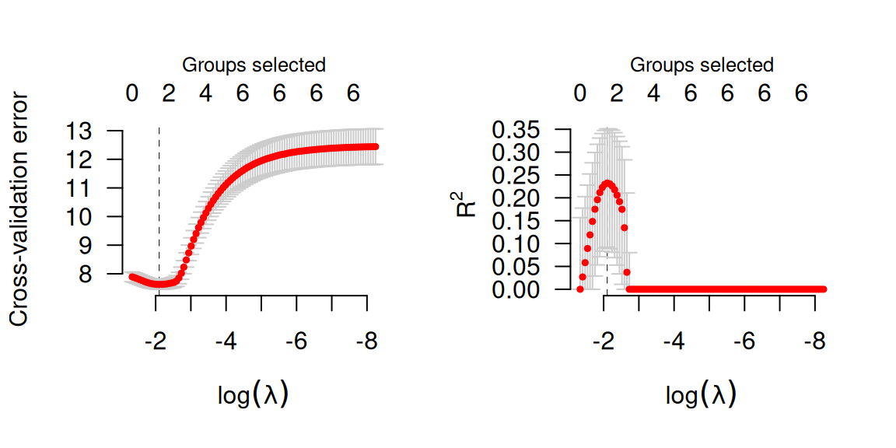
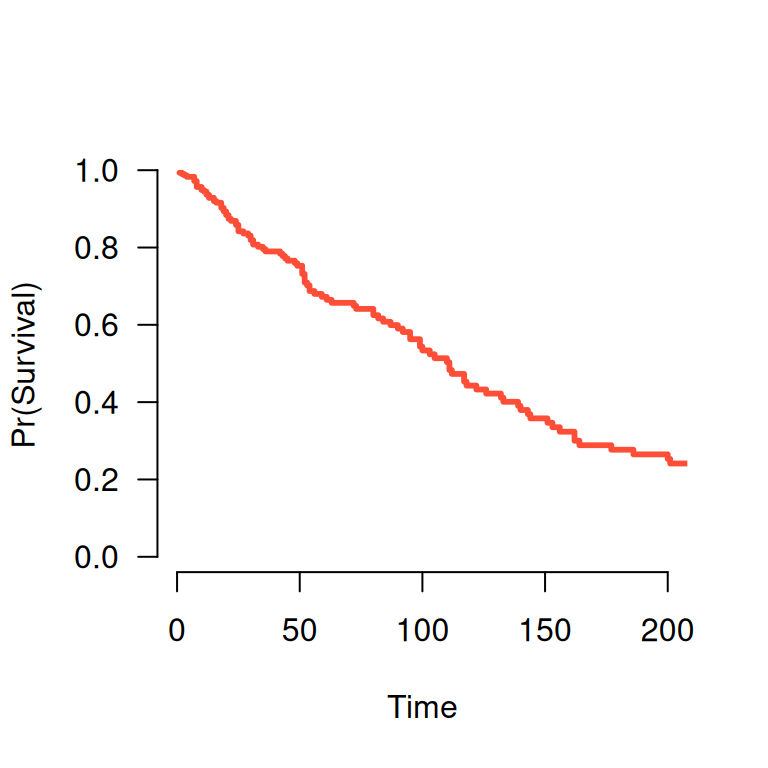
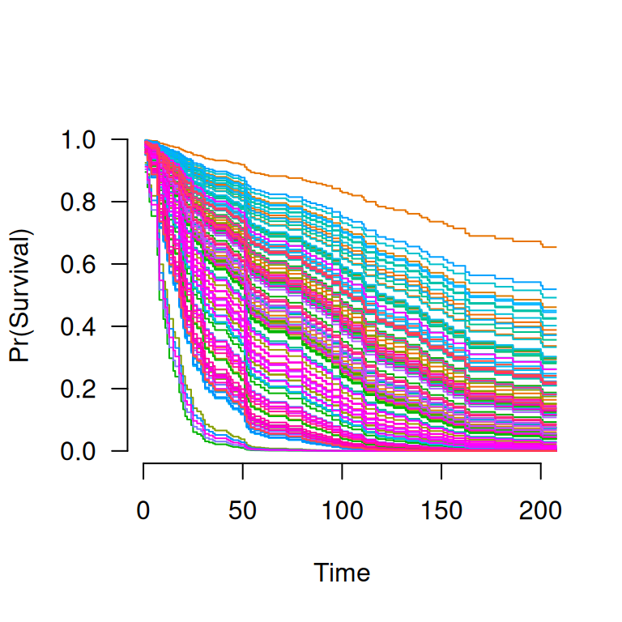

# Models

`grpreg` fits models that fall into the penalized likelihood framework.
Rather than estimating \boldsymbol{\beta} by maximizing the likelihood,
in this framework we estimate \boldsymbol{\beta} by minimizing the
objective function Q(\boldsymbol{\beta}\|\mathbf{X}, \mathbf{y}) =
\frac{1}{n}L(\boldsymbol{\beta}\|\mathbf{X},\mathbf{y}) +
P\_\lambda(\boldsymbol{\beta}), where the loss function
L(\boldsymbol{\beta}\|\mathbf{X},\mathbf{y}) is the negative
log-likelihood (2 times this quantity is known as the deviance),
P\_\lambda(\boldsymbol{\beta}) is the penalty, and \lambda is a
regularization parameter that controls the tradeoff between the two
components. This article describes the different loss models available
in `grpreg`; see
[penalties](https://pbreheny.github.io/grpreg/articles/penalties.md) for
more information on the different penalties available.

## Gaussian (linear regression)

In linear regression, the loss function is simply the squared error
loss: L(\boldsymbol{\beta}\|\mathbf{X},\mathbf{y}) = \frac{1}{2}
\lVert\mathbf{y}-\mathbf{X}\boldsymbol{\beta}\rVert_2^2; this is
proportional to the negative log-likelihood for a model where y follows
a Gaussian distribution with constant variance and mean equal to
\mathbf{X}\boldsymbol{\beta}.

To fit a penalized linear regression model with `grpreg`:

``` r
fit <- grpreg(X, y, group)
```

## Binomial (logistic regression)

In logistic regression, the loss function is:
L(\boldsymbol{\beta}\|\mathbf{X},\mathbf{y}) =
-\sum\_{i:y_i=1}\log\hat{\pi}\_i - \sum\_{i:y_i=0}\log(1-\hat{\pi}\_i);
this is the negative log-likelihood for a binomial distribution with
probabilities P(Y_i=1)=\hat{\pi}\_i given by: \hat{\pi}\_i =
\frac{\exp(\eta_i)}{1+\eta_i}, where \boldsymbol{\eta}=
\mathbf{X}\boldsymbol{\beta} denotes the linear predictors.

To fit a penalized logistic regression model with `grpreg`:

``` r
fit <- grpreg(X, y, group, family='binomial')
```

## Poisson

In Poisson regression, the loss function is:
L(\boldsymbol{\beta}\|\mathbf{X},\mathbf{y}) = 2\sum_i \left\\y_i\log
y_i - y_i\log \mu_i + mu_i - y_i\right\\; note that some of these terms
are constant with respect to \mu_i and can therefore be ignored during
optimization. Twice this loss is the deviance for a Poisson distribution
Y_i \sim \text{Pois}(\hat{\mu}\_i) with rate parameter given by:
\hat{\mu}\_i = \exp(\eta_i).

To fit a penalized Poisson regression model with `grpreg`:

``` r
fit <- grpreg(X, y, group, family='poisson')
```

## Cox proportional hazards

The above models all fall into the category of distributions known as
exponential families (hence the `family`) argument. `grpreg` also allows
users to fit Cox proportional hazards models, although these models fall
outside this framework and are therefore fit using a different function,
`grpsurv`. In Cox regression, the negative log of the partial likelihood
is L(\boldsymbol{\beta}\|\mathbf{X},\mathbf{y}) = -2\sum\_{j=1}^{m} d_j
\eta_j + 2\sum\_{j=1}^{m} d_j \log\left\\\sum\_{i \in R_j}
\exp(\eta_i)\right\\, where t_1 \< t_2 \< \ldots \< t_m denotes an
increasing list of unique failure times indexed by j and R_j denotes the
set of observations still at risk at time t_j, known as the risk set.

The `Lung` data (see
[`?Lung`](https://pbreheny.github.io/grpreg/reference/Lung.md) for more
details) provides an example of time-to-event data that can be used with
Cox regression. Loading this data set into R,

``` r
data(Lung)
X <- Lung$X
y <- Lung$y
group <- Lung$group
```

To fit a penalized Cox regression model,

``` r
fit <- grpsurv(X, y, group)
```

As before, you can call `plot`, `coef`, `predict`, etc. on `fit`:

``` r
coef(fit, lambda=0.1)
#        trt     karno1     karno2     karno3  diagtime1  diagtime2       age1 
#  0.0000000 -4.6535992  0.4641241 -0.3283532  0.0000000  0.0000000  0.0000000 
#       age2       age3      prior   squamous      small      adeno      large 
#  0.0000000  0.0000000  0.0000000 -0.2613796  0.1320625  0.2666665 -0.1424394
```

Cross-validation is similar:

``` r
set.seed(1)
```

``` r
cvfit <- cv.grpsurv(X, y, group)
par(mfrow=c(1,2))
plot(cvfit, type='cve')
plot(cvfit, type='rsq')
```



In addition to the quantities like coefficients and number of nonzero
coefficients that `predict` returns for other types of models,
[`predict()`](https://rdrr.io/r/stats/predict.html) for an `grpsurv`
object can also estimate the baseline hazard (using the
Kalbfleish-Prentice method) and therefore, the survival function. A
method to plot the resulting function is also available:

``` r
S <- predict(fit, X[1,], type='survival', lambda=0.02)
S(365)   # Estiamted survival at 1 year
# [1] 0.09995821
plot(S, xlim=c(0,200))
```



When multiple subjects are involved in the prediction:

``` r
S <- predict(fit, X, type='survival', lambda=0.02)
S[[1]](365)  # Estimated survival at 1 year for subject 1
# [1] 0.09995821
S[[2]](365)  # Estimated survival at 1 year for subject 2
# [1] 0.142846
plot(S, xlim=c(0,200))
```


